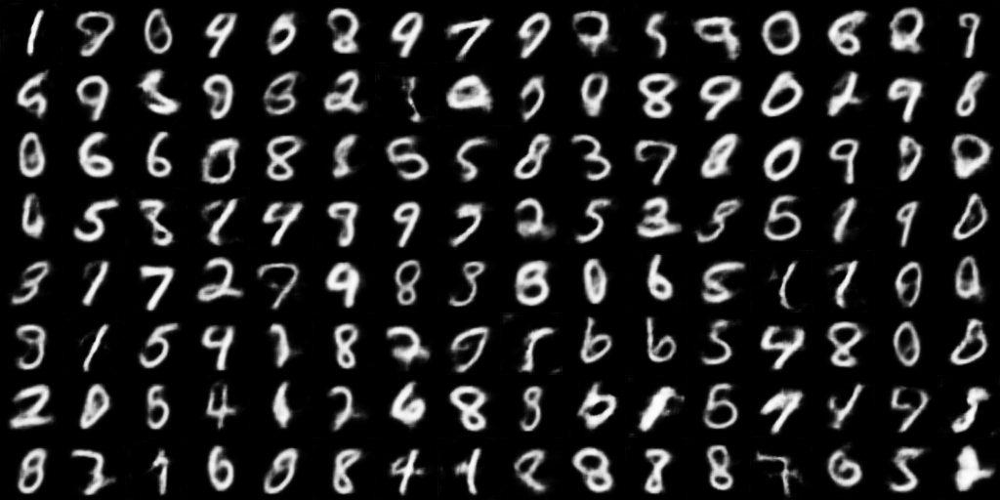

# Convolutional Variational Autoencoder (CVAE) on MNIST

## About

Convolutional variational autoencoder (CVAE) implementation in MLX using MNIST. This is a minimal example ported from the [torch-vae](https://github.com/menzHSE/torch-vae) repo and also submitted to [mlx-examples](https://github.com/ml-explore/mlx-examples) in [PR#264](https://github.com/ml-explore/mlx-examples/pull/264). 


## Variational Autoencoder Implementation Overview

Good overviews of variational autoencoders are provided in [arXiv:1906.02691](https://arxiv.org/abs/1906.02691) and [arXiv:1312.6114](https://arxiv.org/abs/1312.6114).

In our implementation, the input image is not directly mapped to a single latent vector. Instead, it is transformed into a probability distribution within the latent space, from which we sample a latent vector for reconstruction. The process involves:

1. **Encoding to Probability Distribution**: 
   - The input image is linearly mapped to two vectors: 
     - A **mean vector**.
     - A **standard deviation vector**.
   - These vectors define a normal distribution in the latent space.

2. **Auxiliary Loss for Distribution Shape**: 
   - We ensure the latent space distribution resembles a zero-mean unit-variance Gaussian distribution (standard normal distribution).
   - An auxiliary loss, the Kullback-Leibler (KL) divergence between the mapped distribution and the standard normal distribution, is used in addition to the standard reconstruction loss
   - This loss guides the training to shape the latent distribution accordingly.
   - It ensures a well-structured and generalizable latent space for generating new images.

3. **Sampling and Decoding**: 
   - The variational approach allows for sampling from the defined distribution in the latent space.
   - These samples are then used by the decoder to generate new images.

4. **Reparametrization Trick**:
   - This trick enables backpropagation through random sampling, a crucial step in VAEs. Normally, backpropagating through a random sampling process from a distribution with mean ```mu``` and standard deviation ```sigma``` is challenging due to its nondeterministic nature.
   - The solution involves initially sampling random values from a standard normal distribution (mean 0, standard deviation 1). These values are then linearly transformed by multiplying with ```sigma``` and adding ```mu```. This process essentially samples from our target distribution with mean ```mu``` and standard deviation ```sigma```.
   - The key benefit of this approach is that the randomness (initial standard normal sampling) is separated from the learnable parameters (```mu``` and ```sigma```). ```Mu``` and ```sigma``` are deterministic and differentiable, allowing gradients with respect to them to be calculated during backpropagation. 


## Requirements

See [requirements.txt](requirements.txt). 

```pip install -r requirements.txt```

## Limitations

At the time of writing, ```mlx``` does not have tranposed 2D convolutional layers yet. We approximate that by a combination of nearest neighbor upsampling and regular convolutions, e.g. similar to the original U-Net. We intend to update this example once these features are added. 

## Usage

### Model Training

Pretrained (small) models  are available in the ```pretrained``` directory. The models carry information of the maximum number of filters in the conv layers (```--max_filters```) and the number of latent dimensions (```--latent_dims```) in their filename. These models use three conv layers with 16/32/64 features (and corresponding upsampling conv layers in the decoder) and 8 latent dimensions. To train a VAE model use ```python train.py```. 

```
$ python train.py -h
usage: train.py [-h] [--cpu] [--seed SEED] [--batchsize BATCHSIZE] [--max_filters MAX_FILTERS]
                [--epochs EPOCHS] [--lr LR] [--latent_dims LATENT_DIMS]

options:
  -h, --help            show this help message and exit
  --cpu                 Use CPU instead of GPU acceleration
  --seed SEED           Random seed
  --batchsize BATCHSIZE
                        Batch size for training
  --max_filters MAX_FILTERS
                        Maximum number of filters in the convolutional layers
  --epochs EPOCHS       Number of training epochs
  --lr LR               Learning rate
  --latent_dims LATENT_DIMS
                        Number of latent dimensions (positive integer)
```
**Example**

```
$ python train.py 
Options: 
  Device: GPU
  Seed: 0
  Batch size: 128
  Max number of filters: 64
  Number of epochs: 50
  Learning rate: 0.001
  Number of latent dimensions: 8
Number of trainable params: 0.1493 M
Epoch    0 | Loss   19168.17 | Throughput   418.96 im/s | Time    146.6 (s)
Epoch    1 | Loss   11836.96 | Throughput   414.88 im/s | Time    148.4 (s)
Epoch    2 | Loss   10860.28 | Throughput   411.01 im/s | Time    149.7 (s)
...
Epoch   48 | Loss    8325.11 | Throughput   412.93 im/s | Time    149.0 (s)
Epoch   49 | Loss    8318.17 | Throughput   408.13 im/s | Time    150.5 (s)
```

This is on a first gen 16GB M1 Macbook Pro. 

### Reconstruction of Training / Test Data

Datasets can be reconstructed using ```python reconstruct.py```. Images showing original and reconstructed data samples are written to the folder specified by ```--outdir```.

``` 
$ python reconstruct.py -h
usage: reconstruct.py [-h] [--cpu] --model MODEL [--rec_testdata] --latent_dims LATENT_DIMS
                      [--max_filters MAX_FILTERS] --outdir OUTDIR

options:
  -h, --help            show this help message and exit
  --cpu                 Use CPU instead of GPU acceleration
  --model MODEL         Model filename *.pth
  --rec_testdata        Reconstruct test split instead of training split
  --latent_dims LATENT_DIMS
                        Number of latent dimensions (positive integer)
  --max_filters MAX_FILTERS
                        Maximum number of filters in the convolutional layers
  --outdir OUTDIR       Output directory for the generated samples
```


#### Examples

**Reconstructing MNIST**

```python reconstruct.py  --model=pretrained/vae_mnist_filters_0064_dims_0008.npz  --latent_dims=8 --outdir=reconstructions```


### Generating Samples from the Model

The variational autoencoders are trained in a way that the distribution in latent space resembles a normal distribution (see above). To generate samples from the variational autoencoder, we can sample a random normally distributed latent vector and have the decoder generate an image from that. Use ```python generate.py``` to generate random samples. 


``` 
$ python generate.py -h
usage: generate.py [-h] [--cpu] [--seed SEED] --model MODEL --latent_dims LATENT_DIMS
                   [--max_filters MAX_FILTERS] [--outfile OUTFILE] [--nimg_channels NIMG_CHANNELS]

options:
  -h, --help            show this help message and exit
  --cpu                 Use CPU instead of GPU acceleration
  --seed SEED           Random seed
  --model MODEL         Model filename *.pth
  --latent_dims LATENT_DIMS
                        Number of latent dimensions (positive integer)
  --max_filters MAX_FILTERS
                        Maximum number of filters in the convolutional layers
  --outfile OUTFILE     Output filename for the generated samples, e.g. samples.png
  --nimg_channels NIMG_CHANNELS
                        Number of image channels (1 for grayscale, 3 for RGB)
```

#### Examples

**Sample from the VAE models trained on MNIST**

```python generate.py --model=pretrained/vae_mnist_filters_0064_dims_0008.npz  --latent_dims=8 --outfile=samples.png --seed=0``` 



